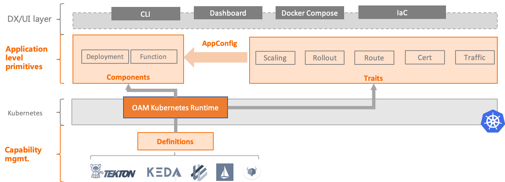

# OAM Kubernetes Runtime

[](https://img.shields.io/github/license/crossplane/oam-kubernetes-runtime?style=flat-square)
[](https://pkg.go.dev/mod/github.com/crossplane/oam-kubernetes-runtime)
[](https://img.shields.io/docker/pulls/crossplane/oam-kubernetes-runtime?style=flat-square)
[](https://gitter.im/oam-dev/community?utm_source=badge&utm_medium=badge&utm_campaign=pr-badge)
[](https://www.tickgit.com/browse?repo=github.com/crossplane/oam-kubernetes-runtime)
[](https://twitter.com/intent/follow?screen_name=oam_dev)

The official Kubernetes plug-in for Open Application Model (OAM).

OAM Kubernetes Runtime implements [OAM specification](https://github.com/oam-dev/spec) to expose application centric API for any Kubernetes, specifically:
- Components - what workload to run?
- Traits - how to operate the workload?
- ApplicationConfiguration - apply traits to component
- Definitions - discover CRD/k8s API resource as workload/trait

This plug-in is designed as building block for creating OAM compliant platform with Kubernetes, rather than being used directly by developers or end-users.

## Architecture



## Prerequisites

- Kubernetes v1.16+
- Helm 3

## Install OAM Kubernetes Runtime

1. Create namespace for OAM runtime controller

```shell script
kubectl create namespace oam-system
```

2. Add helm repo

```console
helm repo add crossplane-master https://charts.crossplane.io/master/
```

3. Install OAM Kubernetes Runtime

You can directly install it without webhook by:

```
helm install oam --namespace oam-system crossplane-master/oam-kubernetes-runtime --devel
```

Or you can install with webhook enabled by following steps:

  - Step 1: Admission Webhook need you to prepare certificates and ca for production use.
    **For none-production use**, you could generate them by running the shell script provided in repo.
    ```shell script
    curl -sfL https://raw.githubusercontent.com/crossplane/oam-kubernetes-runtime/master/hack/ssl/ssl.sh | bash -s oam-kubernetes-runtime-webhook oam-system
    ```

    The shell will generate files like below:

    ```console
    $ tree
    .
    ├── csr.conf
    ├── oam-kubernetes-runtime-webhook.csr
    ├── oam-kubernetes-runtime-webhook.key
    └── oam-kubernetes-runtime-webhook.pem
    
    0 directories, 4 files
    ```

  - Step 2: Create secret for ssl certificates:
    * Notice the server key and certificate must be named tls.key and tls.crt, respectively.
    * Secret name can be user defined, we'd better align with chart values.

    ```shell script
    kubectl -n oam-system create secret generic webhook-server-cert --from-file=tls.key=./oam-kubernetes-runtime-webhook.key --from-file=tls.crt=./oam-kubernetes-runtime-webhook.pem
    ```

  - Step 3: Get CA Bundle info and install with it's value

    ```shell script
    caValue=`kubectl config view --raw --minify --flatten -o jsonpath='{.clusters[].cluster.certificate-authority-data}'`
    helm install core-runtime -n oam-system ./charts/oam-kubernetes-runtime --set useWebhook=true --set certificate.caBundle=$caValue 
    ```

## Get started

* We have some examples in our repo, clone and get started with it.

  ```shell script
  git clone git@github.com:crossplane/oam-kubernetes-runtime.git	
  cd ./oam-kubernetes-runtime	
  ```

* Apply a sample application configuration

  ```shell script
  kubectl apply -f examples/containerized-workload
  ```

* Verify that the application is running

  Check its components:

  ```console
  kubectl get components
  NAME                WORKLOAD-KIND           AGE
  example-component   ContainerizedWorkload   63s
  ```

  Check its application configuration:

  ```console
  kubectl get appconfigs
  NAME                AGE
  example-appconfig   3m48s
  ```

  Check the status and events from the application   
  ```console
  kubectl describe appconfig example-appconfig
  Status:
    Conditions:
      Last Transition Time:  2020-06-12T21:18:40Z
      Reason:                Successfully reconciled resource
      Status:                True
      Type:                  Synced
    Workloads:
      Component Name:  example-component
      Traits:
        Trait Ref:
          API Version:  core.oam.dev/v1alpha2
          Kind:         ManualScalerTrait
          Name:         example-appconfig-trait
      Workload Ref:
        API Version:  core.oam.dev/v1alpha2
        Kind:         ContainerizedWorkload
        Name:         example-appconfig-workload
  Events:
    Type    Reason                 Age              From                                       Message
    ----    ------                 ----             ----                                       -------
    Normal  RenderedComponents     6s (x2 over 7s)  oam/applicationconfiguration.core.oam.dev  Successfully rendered components
    Normal  AppliedComponents      6s (x2 over 6s)  oam/applicationconfiguration.core.oam.dev  Successfully applied components
    Normal  Deployment created     6s (x3 over 6s)  ContainerizedWorkload                      Workload `example-appconfig-workload` successfully server side patched a deployment `example-appconfig-workload`
    Normal  Service created        6s (x3 over 6s)  ContainerizedWorkload                      Workload `example-appconfig-workload` successfully server side patched a service `example-appconfig-workload`
    Normal  Manual scalar applied  6s (x2 over 6s)  ManualScalarTrait                          Trait `example-appconfig-trait` successfully scaled a resouce to 3 instances

  ```

  You should also check underlying deployment and service looking like below
  ```console
  kubectl get deployments
  NAME                                    READY   UP-TO-DATE   AVAILABLE   AGE
  example-appconfig-workload-deployment   3/3   3           3              28s
  ```

  ```console
  kubectl get services
  AME                                             TYPE       CLUSTER-IP     EXTERNAL-IP   PORT(S)    AGE
  example-appconfig-workload-deployment-service   NodePort   10.96.78.215   <none>        8080/TCP   28s
  ```

## Cleanup
```console
helm uninstall core-runtime -n oam-system
kubectl delete -f examples/containerized-workload
kubectl delete namespace oam-system --wait
```

## Community, discussion, contribution
You can reach the maintainers of this project at:
* Slack channel: [crossplane#oam](https://crossplane.slack.com/#oam)

## Want to help?
Check out [DEVELOPMENT.md](./DEVELOPMENT.md) to see how to develop with OAM Kubernetes runtime


## Licenses
The OAM Kubernetes runtime is released under the [Apache 2.0 license](LICENSE).
